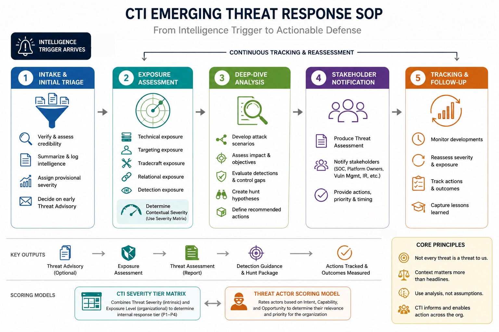

# Chapter 01 – Revisiting CTI for Advanced Threat Hunting

This folder contains a practical CTI operating model that supports Chapter 01 of *Advanced Cyber Threat Intelligence and Hunting*.

Chapter 01 introduces the role of Cyber Threat Intelligence as an operational function that helps defenders understand threats, prioritize defensive action and turn external intelligence into internal security outcomes. However, readers may reasonably ask a practical question:

**What should a CTI team actually do when an intelligence trigger arrives?**

For example:

- A new critical CVE is published
- A security vendor reports an active campaign
- A peer organization in the same sector is compromised
- A threat actor changes targeting patterns
- A supply chain provider is breached
- A geopolitical event increases the likelihood of cyber activity
- A malware family gains a new capability relevant to the organization

This folder answers that question.
The included SOP and scoring models describe how a CTI team can move from an external intelligence trigger to a structured internal response.

## Included files

- `CTI SOP Emerging Threat Response.md` — A five-phase operating procedure for handling emerging intelligence triggers, from intake to follow-up.
- `CTI Severity Tier Matrix.md` — A two-axis scoring model that combines intrinsic threat severity with organization-specific exposure to assign an internal response tier.
- `Threat Actor Scoring Model.md` — A scoring framework for assessing how much of a threat a specific actor poses to the organization, based on intent, capability, and opportunity.

## Why this SOP exists

CTI teams are often judged by the quality of their intelligence products, but their real value depends on what happens after intelligence arrives.

A report, advisory, CVE, campaign write-up, or actor profile is not automatically actionable. The CTI team must determine whether the information is credible, whether it applies to the organization, which teams need to act, what evidence should be collected, what detections or hunts should be prioritized, and how the threat should be tracked over time.

Without a defined procedure, this response can become inconsistent. One analyst may escalate immediately, another may wait for corroboration, another may forward indicators without context, and another may spend days on analysis before involving operational teams. The result is delay, duplication, and uneven prioritization.

The SOP in this folder provides a repeatable workflow that helps CTI teams respond consistently when new intelligence arrives.

## From external intelligence to internal relevance

A central principle of the book is that intelligence only becomes operationally useful when it is contextualized.

A threat may be severe in the abstract but irrelevant to a specific organization. Conversely, a threat that appears moderate externally may be highly significant for an organization with the wrong exposure, weak controls, or critical dependencies.

For example:

- A vulnerability affecting a technology the organization does not run may require tracking, but not emergency response
- A local privilege escalation vulnerability may become critical in a Linux-heavy environment with exposed multi-tenant systems
- A threat actor with world-class capability may not matter if there is no intent to target the organization, its sector, or its geography
- A campaign targeting telecommunications providers may be far more relevant to a telco than to an organization in an unrelated sector
- A supply chain compromise may be critical for one company and negligible for another, depending on vendor usage and dependency depth

This is why CTI should not simply repeat external severity ratings. The team must assess whether the threat is a threat **to the organization being defended**.

## The role of analytical scoring

The scoring models in this folder are designed to make CTI prioritization more consistent, transparent, and defensible.

Analysts inevitably make judgments. They assess credibility, relevance, capability, exposure, and urgency. The purpose of scoring is not to eliminate judgment or create false mathematical precision. Instead, analytical scoring helps analysts make their assumptions explicit.

This is particularly important in CTI because external reporting is noisy. Public attention, vendor marketing, media amplification, and community chatter can distort perceived urgency. A scoring model forces the team to return to the core analytical question:

**How relevant and dangerous is this threat to us?**

## How the three documents work together

The three files should be read as one operating model.

### 1. CTI SOP Emerging Threat Response

The SOP defines the response process.

It is organized into five phases:

1. **Intake & Initial Triage** — Verify the trigger, assess source credibility, summarize the issue, assign provisional severity, and decide whether an early advisory is needed.
2. **Exposure Assessment** — Determine whether the organization is exposed technically, operationally, relationally, or through detection gaps.
3. **Deep-Dive Analysis** — Understand the threat in depth and translate it into realistic attack scenarios, detection opportunities, and hunt hypotheses.
4. **Stakeholder Notification & Final Threat Assessment** — Produce the formal assessment and notify the teams that need to act.
5. **Tracking & Follow-Up** — Reassess the threat over time, track remediation or hunting outcomes, and capture lessons learned.

### 2. CTI Severity Tier Matrix

The severity matrix provides a way to assign an internal response tier to intelligence triggers.

It uses two axes:

- **Threat Severity** — How severe the threat is in the abstract, based on its intrinsic characteristics.
- **Exposure Level** — How exposed the organization is to that threat.

These two axes are combined into a final contextual tier.

This is important because external severity does not equal internal priority. A critical vulnerability, active campaign, or supply chain compromise may require different responses in different organizations. The same trigger may be a P1 for one organization, a P3 for another, and a P4 for a third.

The matrix helps the CTI team move from the external question:

**How bad is this threat?**

to the internal question:

**How bad is this threat for us?**

### 3. Threat Actor Scoring Model

Threat actors require a separate scoring approach because they are persistent.

A vulnerability can be patched. A campaign may end. A malware infrastructure cluster may disappear. But a threat actor continues to evolve over time. For this reason, actor relevance should be tracked as a persistent analytical assessment rather than recalculated from scratch each time a new report appears.

The actor scoring model assesses three dimensions:

- **Intent** — Does the actor want to target us, our sector, our geography, or organizations like us?
- **Capability** — Can the actor execute operations at the level required to affect us?
- **Opportunity** — Does the actor have a realistic path to us through our sector, technology, exposure, relationships, or control gaps?

This distinction matters. A highly capable actor is not automatically a high-priority threat. Capability without intent does not create the same level of risk. Similarly, an actor with moderate capability may become highly relevant if it is actively targeting the organization’s sector and has clear opportunity to reach similar environments.

The model therefore helps CTI teams avoid a common analytical mistake: prioritizing actors based only on fame, sophistication, or media attention.

## Suggested workflow

A practical way to use these files is:

1. Start with the SOP when a new intelligence trigger arrives.
2. During Phase 1, assign a provisional severity based on the intrinsic properties of the trigger.
3. During Phase 2, assess exposure in the organization’s actual environment.
4. Use the Severity Tier Matrix to assign the final contextual tier.
5. If the trigger relates to a threat actor, use the Threat Actor Scoring Model to assess the actor’s persistent relevance.
6. During Phase 3, convert the threat into realistic attack scenarios, detection opportunities, and hunt hypotheses.
7. During Phase 4, issue a Threat Assessment with specific recommended actions for each stakeholder team.
8. During Phase 5, track remediation, detection deployment, hunt outcomes, re-tiering decisions, and lessons learned.

This creates the operational loop described throughout the book:

**external intelligence → internal assessment → exposure analysis → detection and hunting → feedback → improved intelligence**

The most important idea behind this workflow is simple: **A threat is not equally threatening to every organization.** CTI exists to understand that difference.

The role of the CTI team is not only to know what is happening externally, but to determine what it means internally: whether the organization is exposed, which assets are at risk, which teams need to act, which telemetry can confirm or refute the threat, and which defensive actions should be prioritized first.

That is what turns data into intelligence, and intelligence into action.